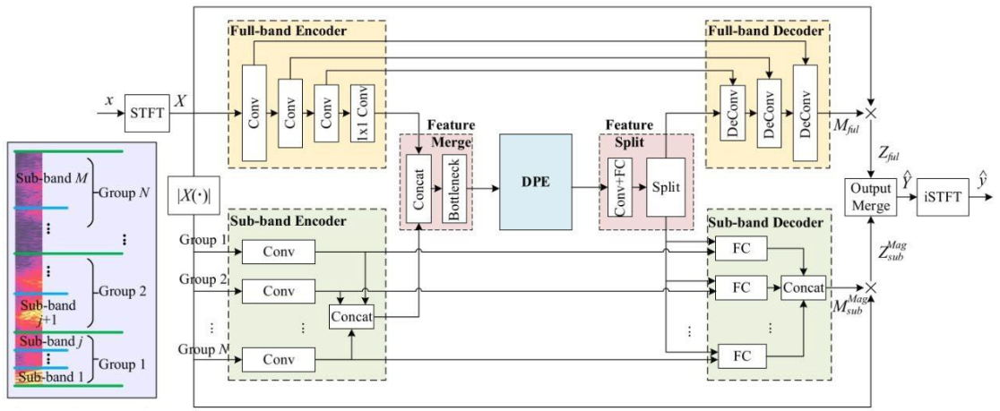
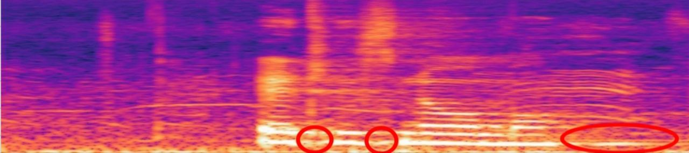
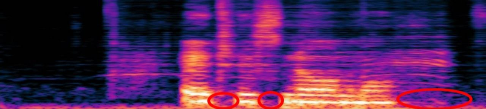
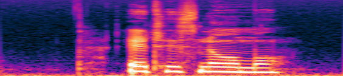

# Модель совместного шумоподавления и дереверберации

## Данные

Модель была обучена на датасетах:
* [VoiceBank+Demand](https://datashare.ed.ac.uk/handle/10283/2791?show=full) — аудио с речью и шумы для тестирования
* [TAU Urban Acoustic Scenes 2019](https://zenodo.org/records/2589280) — шумы, на которых обучалась модель

Реверберация генерировалась при помощи библиотеки pyroomacoustics с ```rt60 = uniform(0.1, 0.7)```

Шум добавлялся к аудио с ```SNR = uniform[0, 5, 10, 15]```


## Архитектура модели


<p style="text-align: center;">Архитектура FSPEN</p>

За основу была взята архитектура FSPEN.

Основная идея архитектуры: разбиение спектрограммы на полосы частот и их раздельная обработка.

Sub-band энкодер нужен для того, чтобы компенсировать малое количество слоёв в full-band энкодере/декодере.

Спектрограмма делится на N субполос, причём нижние полосы частот делятся с меньшим шагом, чем высокие(т.к. речь человека в чаще находится в низком диапазоне).

## Метрики

Метрики модели на VoiceBank+DEMAND:

| Метрика | Значение |
| ------- | -------- |
| STOI    |   0.84   |
| NISQA-MOS | 3.12   |
| NISQA-NOISE | 3.87 |

RTF = 0.094

## Пример


<p style="text-align: center;">Зашумлённый и реверберированный сигнал</p>


<p style="text-align: center;">Сигнал после обработки FSPEN'ом</p>


<p style="text-align: center;">Чистый сигнал</p>
