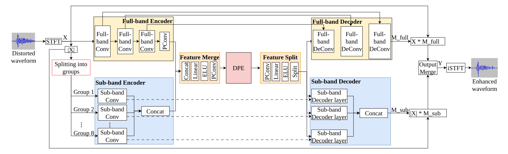
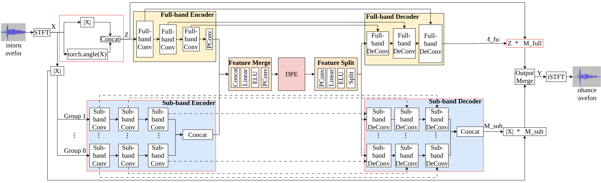
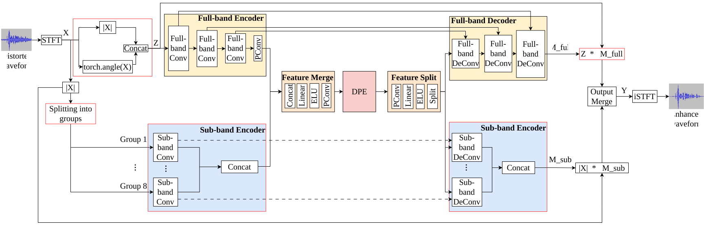

# FSPEN-Plus

**FSPEN-Plus** — легковесная нейросетевая модель для улучшения качества речевого сигнала в реальном времени: совместное **подавление шума и реверберации** для аудио с частототой дискретизации **48 kHz**. Архитектура развивает идею FSPEN (full-band + sub-band, dual-path RNN): исходный FSPEN ориентирован на шумоподавление. Здесь те же принципы перенесены на full-band обработку и задачу деревербации при сохранении умеренной вычислительной стоимости и размера модели.

Модель рассчитана на потоковую обработку и пакетную (файлы). В репозитории — обучение, инференс, локальные демо и веб-интерфейс с четырьмя вариантами конфигурации (baseline, overlap, SBLE, SBDC+overlap).

**Ключевые особенности:**

- обработка **full-band** моно-аудио;
- одновременное **denoise + dereverb** (обучение на синтетических смесях речи, шума и RIR);
- несколько пресетов под разный компромисс качество / RTF / задержка;
- демо с отображением **RTF** (real-time factor) и спектрограмм входа/выхода.

## Про FSPEN+

Бейзлайн был изначально предназначен только для задачи шумоподавления для **16 kHz** аудио, поэтому модель имеет некоторые слабые места. Чтобы от них избавиться, были предложены модификации модели.

Во-первых, из повышения частоты дискретизации входного сигнала следует повышение $\text{N\_STFT}$ с $512$ до $1024$. Значит, понялись входные размерности и изначальное разбиение на группы из FSPEN не подходит. Чтобы учесть расширение частотного диапазона, были было увеличено количество частотных групп в sub-band слоях.

Во-вторых, в бейзлайне свертки в sub-band энкодере обрабатывали группы независимо друг отдруга, хотя частоты физически связанны между собой. Чтобы избавиться от независимости групп, можно задавать их частотные диапазоны с пересечением. Кроме того, независимость групп может создавать искажения на границах. Чтобы избежать этого, границы частотных групп берутся с пересечением. Перечисленные пункты на схемах будут называться **Splitting into groups**.

В-третьих, одной из проблем архитектуры является малое рецептивное поле и менее информативные признаки. Чтобы это исправить, было решено увеличить количество слоёв в sub-band encoder/decoder. Также были подвергнуты изменениям sub-band свёрточные слои. Были заменены функции активации, а в sub-band decoder вместо линейных слоёв используются свёртки. Последние активации у full-band и sub-band decoder были заменены на ```nn.Sigmoid``` для масок для магнитуды, на ```nn.Tanh``` для масок для фазы.

Также в некоторых модификациях для full-band encoder было изменено представление входа с вещественной и мнимой части на "магинтуду-фазу"

Получились следующие модификации:

* FSPEN + 48 kHz – sub-band энкодер изменён таким образом, чтобы он мог работать со спектрограммой, полученной при помощи STFT с N_FFT = 1024.
* FSPEN + 48 kHz + overlap – границы частотных групп изменены так, чтобы они были с перекрытием.
* FSPEN + 48 kHz + sub-band layers extension (SBLE) – увеличение количества слоёв в sub-band энкодере и декодере, изменение слоёв энкодера с линейных на свёртки, изменение представления спектрограммы с вещественной и мнимой части на магнитуду и фазу.
* FSPEN + 48 kHz + sub-band decoder conv (SBDC) + overlap – пересечение частотных групп, изменение слоёв энкодера с линейных на свёртки, изменение представления спектрограммы с вещественной и мнимой части на магнитуду и фазу.


<p style="text-align: center;">Схема FSPEN + 48 kHz + overlap</p>


<p style="text-align: center;">Схема FSPEN + 48 kHz + sub-band layers extension (SBLE)</p>


<p style="text-align: center;">Схема FSPEN + 48 kHz + sub-band decoder conv (SBDC) + overlap</p>

## Быстрый старт

Для проверки работоспособности моделей можно воспользовать Hugging Face Space https://huggingface.co/spaces/G1B-B0N/fspen_denoise_dereverb. Он содержит в себе 2 режима работы модели: Live, File.

В Live модель в реальном времени обрабатывает аудио, захаватываемый микрофоном, демонстрируя то, как выглядит спектрограмма изначально и после обработки. Кроме того, параллельно воспроизводится восстановленный сигнал, чтобы можно услышать результат работы модели (**рекомендуется использовать наушники**). Также предусмотрен мониторинг значения ```RTF```.

В разделе File можно обработать уже записанный файл. Для долгих записей рекомендуется использовать чанкирование(нажать на соответствующую кнопку)

Для каждого раздела можно выбрать одну из 4-х моделей и размер чанка.

Если же Hugging Face Space не запускается или зависает, то демо приложение можно запустить локально, но перед тем, установите версии библиотек из ```requirements.txt```:

```
python web_app.py --preset fspen_48khz_overlap --chunk-ms 512
```

Также можно локально протестировать только качество восстановленного сигнал:

```
python demo_mic.py --config TrainConfig_48kHz_overlap  --checkpoint checkpoints/fspen_chkp/TrainConfig_48kHz_overlap.pt --chunk-ms=512
```


## Датасет

Модель была обучена на датасетах:
* [VoiceBank+Demand](https://datashare.ed.ac.uk/handle/10283/2791?show=full) — аудио с речью и шумы 
* [TAU Urban Acoustic Scenes 2019](https://zenodo.org/records/2589280) — дополнительные шумы

Файлы с RIR были сгенерированы при помощи Python библиотеки pyroomacoustics. RIR файлы были разделены на 4 группы с разными параметрами. Общие параметры каждой группы: высота комнаты $\text{uniform}(2.5, 3.0)$ метров, отношение сторон комнаты $[1 : 3, 2 : 3, 1 : 1]$ (вероятность выбора $0.5$, $0.25$, $0.25$ соответственно). Каждая группа была разбита на train, validation, test следующим образом: $0.7$, $0.15$, $0.15$. Уникальные параметры групп следующие:

* Первая группа представляет из себя комнату малого размера (прямоугольный параллелепипед) с площадью комнаты из $\text{uniform}(15, 30) m^2$ , $\text{rt60} = \text{uniform}(0.4, 0.5)$, 200 файлов.
* Вторая группа – комната среднего размера: площадь $= \text{uniform}(30, 80) m^2$, $\text{rt60} = \text{uniform}(0.5, 0.7)$, 400 файлов.
* Третья группа – комната большого размера: площадь $= \text{uniform}(80, 120) m^2$, $\text{rt60} = \text{uniform}(0.7, 0.85)$, 160 файлов.
* Четвёртая группа – комната большого размера с длинной реверберацией: площадь $= \text{uniform}(80, 120) m^2$ , $\text{rt60} = \text{uniform}(0.85, 1.)$, 80 файлов.

Шум тоже был разбит на 3 выборки таким образом (train,
validation, test): 1318, 309, 180. Всего 34 вида шума, каждая часть данных содержит все виды шума. ```SNR``` для смешивания шума с сигналом выбирался случайно из списка $[0, 5, 10, 15]$ (значения равновероятны)


## Метрики

Результаты показывают, что ключевым фактором повышения качества является переход FSPEN на обработку аудио с частотой 48 кГц и способность подавлять реверберацию. Предлагаемые модели достигают существенного роста всех основных метрик относительно исходного FSPEN при сохранении крайне малой вычислительной сложности. По сравнению с бейзлайном, количество параметров выросло не более чем в 2 раза, а количество MACs не более чем в 3.  Наилучший наилучшие показатели подавления шума и реверберации и баланс между качеством и качеством показывает  FSPEN + 48 kHz + Overlap. Несмотря на некоторое отставание от DeepFilterNet по абсолютному качеству, предложенные модели требуют на порядок меньше параметров и вычислений, что делает их привлекательными для применения на ресурсно-ограниченных устройствах и в системах реального времени. Более того, обученные модели очень близки к образцовому аудио по метрикам шумоподавления.

| Model    | Params. | MACs | PESQ | NISQA-MOS | NISQA-NOISE | SRMR | STOI | RTF (@ 1 s) |
| -------   | -------- | --| -- | -- | -- | -- | -- | -- |
| Noisy and Reverb | — | — | $1.68$  | $2.73$ | $2.40$ | $6.64$ | $0.82$ | — |
| Ground Truth | — | — | — | $4.07$ | $4.12$ | $1.0$ | $8.94$ | — |
| FSPEN | $79\text{k}$ | $2.6\text{M}$ | $1.56 \pm 0.23 $ | — | — | $8.25 \pm 1.25$ | $0.72 \pm 0.08$ | $0.08 \pm 0.01$  |
| FSPEN + 48 kHz (prop.) | $93\text{k}$ | $5.6\text{M}$ | $2.39 \pm 0.19$ | $3.74 \pm 0.13$ | $3.99 \pm 0.12$ | $9.47 \pm 0.65$ | $0.88 \pm 0.02$ | $0.11 \pm 0.01$ | 
| FSPEN + 48 kHz + SBLE (prop.) | $137\text{k}$ | $6.2\text{M}$ | $2.32 \pm 0.05$ | $3.67 \pm 0.13$ | $3.87 \pm 0.03$ | $7.8 \pm 0.09$ | 0.80 \pm 0.00 | 0.13 \pm 0.03 |
| FSPEN + 48 kHz + SBDC + Overlap (prop.) | $111\text{k}$ | $6.0\text{M}$ | $2.33 \pm 0.08$ | $3.64 \pm 0.16$ | $3.88 \pm 0.08$ | $7.8 \pm 0.21$ | $0.80 \pm 0.01$ | $0.13 \pm 0.01$ |
| FSPEN + 48 kHz + Overlap (prop.)| $95\text{k}$ | $5.6\text{M}$ | $2.35 \pm 0.28$ | $3.73 \pm 0.13$ | $4.00 \pm 0.12$ | $9.6 \pm 0.45$ | $0.88 \pm 0.01$ | $0.11 \pm 0.01$ |
| GTCRN | $48\text{k}$ | $8.1\text{M}$ | $2.10$ | — | — | $8.22$ | $0.86$ | $0.03$ |


